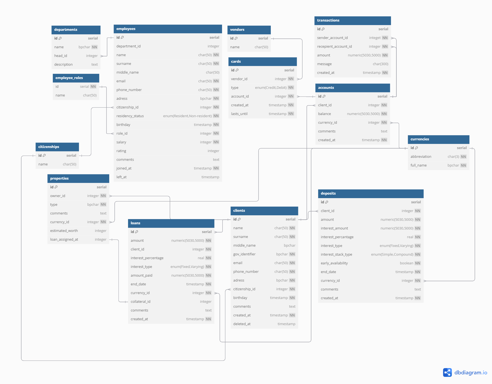

# dm_dbms
# Александр Политанский 253505
### Информационная система для банка
***Описание:***
Информационная система для банка - это программное обеспечение, предназначенное для хранения и обработки данных, требующихся для обеспечения работы данных. Оно хранит все воможные данные и обеспечивает к ним доступ для чтения, изменения.

***Цель проекта:***
Получить опыть проектирования БД, написания sql запросов и применения их в прикладном приложении

